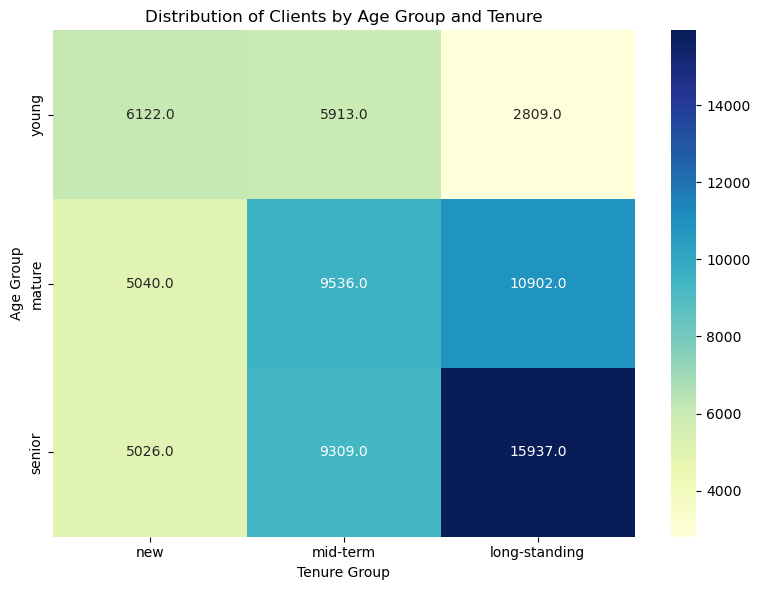
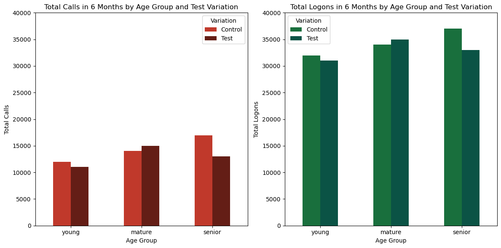
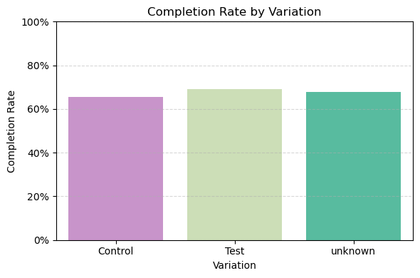
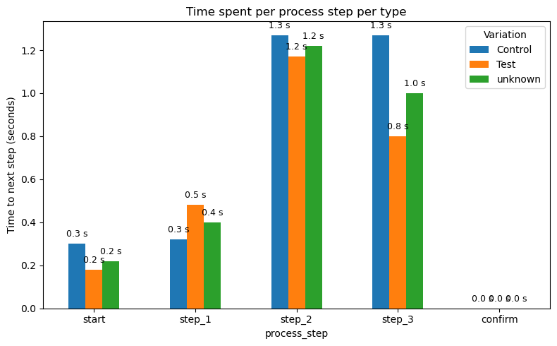
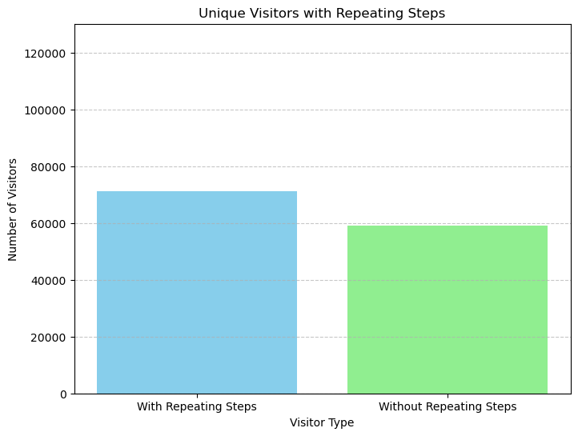

# vanguard-ab-test

# PROJECT OVERVIEW 🎢

We are the Customer Experience (CX) team at Vanguard, the US-based investment management company. 

The digital world is evolving, and so are Vanguard’s clients. Vanguard believes that a more intuitive and modern User Interface (UI), coupled with timely in-context prompts (cues, messages, hints, or instructions provided to users directly within the context of their current task or action), could make the online process smoother for clients. The critical question is: **Would these changes encourage more clients to complete the process?**

Our team launched an exciting digital experiment, and now, we need to uncover the results using the skills of our data analysts.

An A/B test was set into motion from **3/15/2017 to 6/20/2017** by the team:

*Control Group: Clients interacted with Vanguard’s traditional online process.
Test Group: Clients experienced the new, spruced-up digital interface.*

Both groups navigated through an identical process sequence: an initial page, three subsequent steps, and finally, a confirmation page signaling process completion.
The goal is to see if the new design leads to a better user experience and higher process completion rates.

# Data Description 📁

The analysis uses data from multiple sources, including:
- **Client Profiles (df_final_demo)**: Demographics like age, gender, and account details of our clients.
- **Digital Footprints (df_final_web_data)**: A detailed trace of client interactions online, divided into two parts: pt_1 and pt_2. It’s recommended to concatenate these two files prior to a comprehensive data analysis.
- **Experiment Roster (df_final_experiment_clients)**: A list revealing which clients were part of the grand experiment.

## ⚙ **Tech Stack**  
- Python 🐍  
- Pandas 📊  
- Matplotlib 📈  
- Seaborn 🎨  
- MySQL 🗄️  
- Tableau 📊

# Methodology 📈

- Data cleaning & merging across tables using `pandas`
- Feature engineering: total tenure, step duration, user segmentation
- Visualizations with `matplotlib` & `seaborn`
- Statistical testing:
  - Proportions Z-test (completion rates)
  - T-test (time differences by group)
  - Exploration of outliers and medians

# Tasks to complete the analysis
**Task I - EDA**
This task was meant to: 
- Dataset Exploration
- Client behavior analysis

**Task II - KPIs**
- The purpose of this task was to understand the following success indicators:
  - Completion Rate;
  - Time Spent on Each Step;
  - Error Rates

**Task III - Hypothesis Testing**
This part of the analysis was to unserstand if the changes made on the digital solution were worth it. For that the hypothesis tested were:
  - Completion Rate;
  - Completion Rate with a Cost-Effectiveness Threshold;
  - Gender differences;
  - Young versus senior clients

**Task IV - Experiment evaluation**
Analysis to understand if the experimentation was well structured, regarding:
  - Design Effectiveness
  - Duration Assessment

**Task V - Tableau**
Creation of insightful and interactive visualizations using Tableau

# Key findings and conclusions 🔎

- **The Test group showed a higher overall completion rate** (statistically significant, p < 0.0001)
- **Younger users** responded better to the new design
- **Step 2** was the most time-consuming step when analyzing medians — possibly a friction point
- There were **outliers** inflating average time values, so medians were used for a more realistic view
- **Client tenure** and **age group** affect conversion behavior

## Visual Insights 📊

**EDA**

**KPIs**

# Links
- [Tableau](https://public.tableau.com/app/profile/helin.kar/viz/ab-testing/Dashboard2?publish=yes)
- [Project Presentation](Vanguard_analysis.pdf)
- [Trello](https://trello.com/b/EMZhlvAo/vanguard)

# Contributors 🤝:
- [Helin Ozgekar](https://github.com/helinozge)
- [Klaudija Karat](https://github.com/KlaudijaK)
- [Sofia Araújo](https://github.com/SofyMelvill)